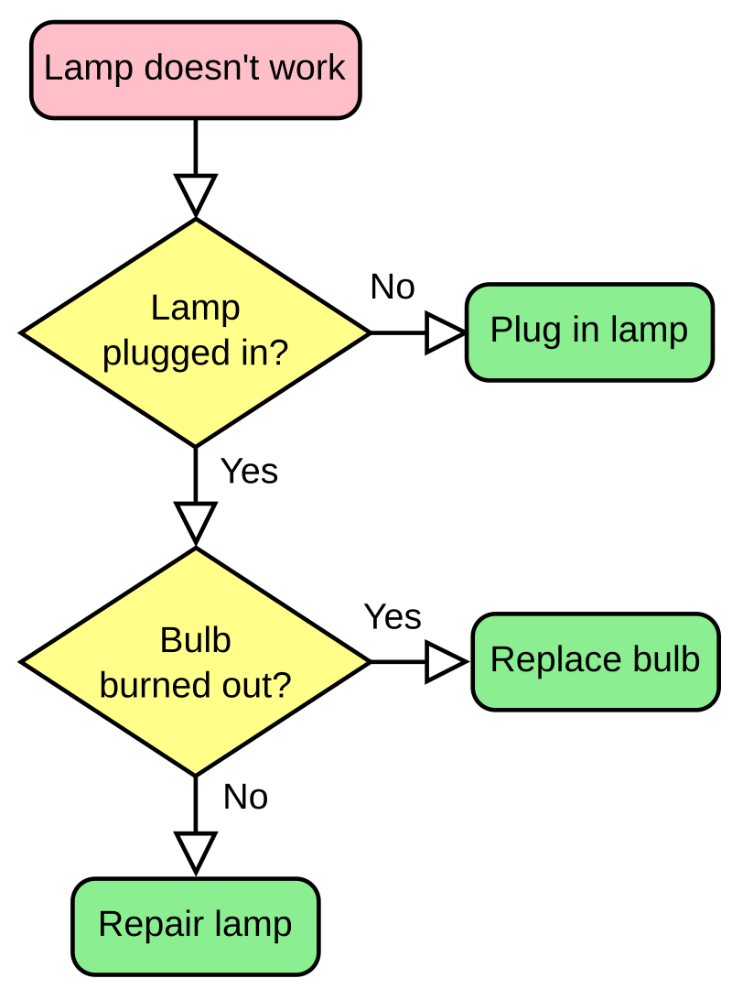

# Assessment Task 1 - UX Design
### By Mr Scott
## Requirements Outline
### Functional Requirements
* Useability
    * Sub point
        * Sub sub point

### Non-Functional Requirements
* Efficiency
    * Sub point

| Product | Plus    | Minus | Implications |
| ----------- | ----------- | --------| ------ |
| Header | Title | 
| Paragraph | Text |